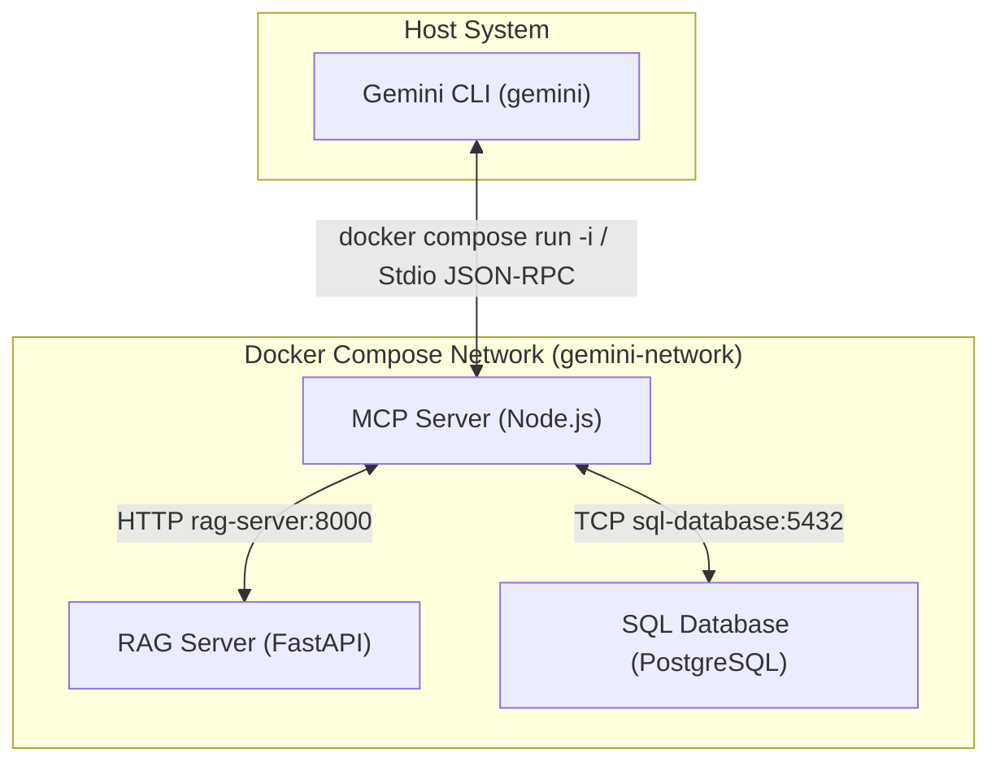

# Gemini Extension for Automation Hardware Specs & Inventory

This project is a local-first extension for the `gemini` CLI. It bridges the Gemini LLM to local enterprise automation hardware systems: a **RAG (Retrieval-Augmented Generation) Server** for unstructured technical manuals and specifications, and a **SQL Database** for structured pricing, stock, and inventory data.

## System Architecture

All backend components run in Docker and are orchestrated by Docker Compose. The Gemini CLI spawns the MCP server container on demand via stdio:



---

## Workspace Directory Structure

The workspace is organized into self-contained component directories:

```
.
├── .cursorrules              # Project rules for editors & AI agents
├── .gemini/
│   └── skills/
│       └── gemini-extension-architect/
│           └── SKILL.md      # Rules skill for gemini CLI
├── mcp-server/               # Exposes SQL & RAG tools to Gemini
│   ├── Dockerfile            # Container image for the MCP server
│   ├── package.json          # Node dependencies (@modelcontextprotocol/sdk, pg, zod)
│   ├── server.js             # MCP server implementation
│   └── clients/              # RAG and SQL client modules (mock data for now)
├── rag-server/               # RAG service for hardware documents (implemented)
│   ├── Dockerfile            # Bakes the multilingual-e5 model during build
│   ├── requirements.txt      # fastapi, chromadb, sentence-transformers, pymupdf, langchain-text-splitters
│   ├── app/
│   │   ├── main.py           # FastAPI /health and /search (cosine, score threshold)
│   │   ├── embeddings.py     # multilingual-e5-base with query/passage prefixes
│   │   └── ingest.py         # PyMuPDF + RecursiveCharacterTextSplitter -> ChromaDB
│   └── documents/            # Curated sample PDFs + error_codes.json
├── sql-database/             # Pricing & inventory database (implemented)
│   ├── Dockerfile            # Postgres image with automated database seed
│   ├── init.sql              # Generated schema + catalog seed (do not edit by hand)
│   └── scripts/
│       └── extract_from_excel.py  # Dev tool: regenerates init.sql from the product Excel
├── docker-compose.yml        # Orchestrates all containers
├── gemini-extension.json     # Extension configuration manifest
├── GEMINI.md                 # Extension instruction guidelines
└── README.md                 # This file
```

---

## Component Specifications

### 1. Extension Manifest & Instructions
- **`gemini-extension.json`**: Tells the `gemini` CLI how to load this extension and spawn the MCP server container.
  ```json
  {
    "name": "gemini-mcp-hardware-extension",
    "version": "1.0.0",
    "description": "Access automation hardware specifications and stock levels.",
    "mcpServers": {
      "hardware-mcp": {
        "command": "docker",
        "args": [
          "compose",
          "-f", "${extensionPath}${/}docker-compose.yml",
          "run", "--rm", "-i",
          "mcp-server"
        ],
        "cwd": "${extensionPath}"
      }
    },
    "contextFileName": "GEMINI.md"
  }
  ```
- **`GEMINI.md`**: Provides instruction overrides to Gemini. It explains how to match informal user descriptions (e.g. *"Siemens S7-1200 PLC"*) to part numbers (e.g., `6ES7214-1AG40-0XB0`) by query chaining (first search specs via RAG, then look up price/stock via SQL).

### 2. MCP Server (`mcp-server/`)
- Written in **Node.js**, containerized with a `Dockerfile`, and spawned on demand by the Gemini CLI.
- Exposes four tools to the model:
  1. `search_specs(query: string)`: Semantic search over the RAG server (`RAG_URL`). Returns `[]` when nothing clears the score threshold, so the model can say it has no answer.
  2. `get_stock_and_price(part_number: string)`: Looks up price and stock in PostgreSQL (`DATABASE_URL`) by typecode **or** material number. Parameterized, read-only.
  3. `list_parts()`: Lists the catalog from PostgreSQL.
  4. `ask_assistant(question: string)`: Convenience tool that runs RAG, best-effort chains into an SQL lookup, and asks Gemini to answer grounded in that context (requires `GEMINI_API_KEY`).
- **CRITICAL**: The server uses `process.stderr` / `console.error` for all debug and logging activities to avoid polluting `stdout`, which is reserved exclusively for JSON-RPC communications.
- Client modules read `RAG_URL` and `DATABASE_URL` from environment variables injected by `docker-compose.yml`.

### 3. RAG Server (`rag-server/`) — Implemented

- A Python FastAPI server containerized to isolate machine learning libraries.
- Embeddings: `intfloat/multilingual-e5-base` (handles Spanish queries over English docs; 512-token context). The model is baked into the image at build time, so the container runs fully offline.
- Vector store: **ChromaDB** (`PersistentClient`, cosine space) on the `chromadata` volume.
- Ingestion (on first startup, idempotent): a curated sample of ctrlX PDFs (`documents/*.pdf`) is parsed with PyMuPDF and split with `RecursiveCharacterTextSplitter`; `documents/error_codes.json` is indexed one error per chunk for fault diagnosis.
- `GET /search?query=...&k=5` returns `{query, backend, results}`. Results below `RAG_MIN_SCORE` (default `0.80`) are dropped so out-of-scope questions return an empty list.
- Activated via the `backends` Compose profile (host port `8000`).

### 4. SQL Database (`sql-database/`) — Implemented

- A containerized PostgreSQL instance, seeded on first init from `init.sql`.
- Normalized schema: `technologies → product_lines → solutions → products → prices / inventory`, with `typecode` and `material_number` UNIQUE on `products`.
- `init.sql` is **generated** by `scripts/extract_from_excel.py` from the real product workbook (`Proyecto/Información/Database/...`). Inventory is synthetic (deterministic from the product id) since the source has no stock data.
- Seeded with the real Bosch Rexroth **ctrlX** catalog sample (174 products: ctrlX CORE/IO/DRIVE/SAFETY/OS, etc.).
- Activated via the `backends` Compose profile. Host port **5433** (mapped to container `5432`) to avoid colliding with other local Postgres instances; inter-service traffic uses `sql-database:5432`.

---

## Architectural Guideline Enforcement

To ensure future developers and AI editors follow these boundaries, two rulesets have been created:

1. **[.cursorrules](file:///.cursorrules)**: Enforces component isolation, Dockerization standards, and MCP stdio safety directly inside Cursor or matching IDE agents.
2. **[.gemini/skills/gemini-extension-architect/SKILL.md](file:///.gemini/skills/gemini-extension-architect/SKILL.md)**: An on-demand agent skill loaded by the `gemini` CLI when updating or adding modules. It provides the model with architecture verification instructions.

---

## Setup Instructions

1. **Configure secrets**: copy `mcp-server/.env.example` to `.env` at the repo root and set `GEMINI_API_KEY` (only needed for the `ask_assistant` tool).
2. **Start the backends** (RAG + SQL). First build is slow because the e5 model is downloaded and baked into the image:
   ```bash
   docker compose --profile backends up --build -d
   ```
   - RAG: `http://localhost:8000/health` · SQL: `localhost:5433` (user/pass/db = `hardware`).
3. **Build the MCP Server image**:
   ```bash
   docker compose build mcp-server
   ```
4. **Link & Enable Extension**, then **launch Gemini**:
   ```bash
   gemini extensions link .
   gemini
   ```

### Regenerating the SQL seed

`sql-database/init.sql` is generated from the product workbook. To rebuild it (requires `pip install openpyxl`):

```bash
python sql-database/scripts/extract_from_excel.py
docker compose --profile backends up --build -d sql-database   # re-seed (use `down -v` to wipe the volume first)
```
