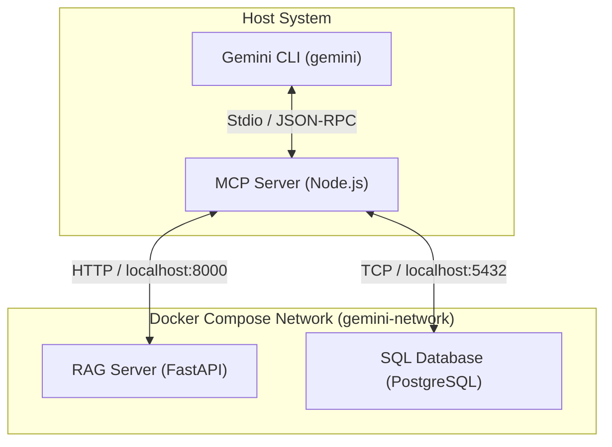

# Gemini Extension for Automation Hardware Specs & Inventory

This project is a local-first extension for the `gemini` CLI. It bridges the Gemini LLM to local enterprise automation hardware systems: a **RAG (Retrieval-Augmented Generation) Server** for unstructured technical manuals and specifications, and a **SQL Database** for structured pricing, stock, and inventory data.

## System Architecture

The following diagram illustrates how the `gemini` CLI communicates with the MCP server on the host, which in turn acts as a gateway to the containerized services orchestrated by Docker Compose:



---

## Workspace Directory Structure

The workspace is organized into self-contained component directories:

```
.
├── .cursorrules              # Project rules for editors & AI agents
├── .gemini/
│   └── skills/
│       └── gemini-extension-architect/
│           └── SKILL.md      # Rules skill for gemini CLI
├── mcp-server/               # Exposes SQL & RAG tools to Gemini
│   ├── package.json          # Node dependencies (@modelcontextprotocol/sdk, pg, zod)
│   └── server.js             # MCP server implementation
├── rag-server/               # RAG service for hardware documents
│   ├── Dockerfile            # Caches SentenceTransformers model during build
│   ├── requirements.txt      # Python libraries (fastapi, sentence-transformers, etc.)
│   ├── main.py               # FastAPI search and indexing API
│   └── documents/
│       └── specs.json        # Technical specifications & manual excerpts
├── sql-database/             # Pricing & inventory database
│   ├── Dockerfile            # Postgres image with automated database seed
│   └── init.sql              # Database schema & hardware catalog seeding
├── docker-compose.yml        # Orchestrates RAG & SQL containers
├── gemini-extension.json     # Extension configuration manifest
├── GEMINI.md                 # Extension instruction guidelines
└── README.md                 # This file
```

---

## Component Specifications

### 1. Extension Manifest & Instructions
- **`gemini-extension.json`**: Tells the `gemini` CLI how to load this extension and execute the MCP server.
  ```json
  {
    "name": "gemini-mcp-hardware-extension",
    "version": "1.0.0",
    "description": "Access automation hardware specifications and stock levels.",
    "mcpServers": {
      "hardware-mcp": {
        "command": "node",
        "args": ["${extensionPath}${/}mcp-server${/}server.js"],
        "cwd": "${extensionPath}"
      }
    },
    "contextFileName": "GEMINI.md"
  }
  ```
- **`GEMINI.md`**: Provides instruction overrides to Gemini. It explains how to match informal user descriptions (e.g. *"Siemens S7-1200 PLC"*) to part numbers (e.g., `6ES7214-1AG40-0XB0`) by query chaining (first search specs via RAG, then look up price/stock via SQL).

### 2. MCP Server (`mcp-server/`)
- Written in **Node.js** to align with the CLI's native runtime environment.
- Exposes three key tools to the model:
  1. `search_specs(query: string)`: Calls `http://localhost:8000/search?query=...` on the RAG server.
  2. `get_stock_and_price(part_number: string)`: Directly queries the PostgreSQL database container.
  3. `list_parts()`: Queries PostgreSQL for the full catalog index.
- **CRITICAL**: The server uses `process.stderr` / `console.error` for all debug and logging activities to avoid polluting `stdout`, which is reserved exclusively for JSON-RPC communications.

### 3. RAG Server (`rag-server/`)
- A Python FastAPI server containerized to isolate machine learning libraries.
- Uses `sentence-transformers/all-MiniLM-L6-v2` for generating dense embeddings.
- Features:
  - Embeddings are computed and cached on startup from `documents/specs.json`.
  - Exposes `GET /search?query=...` which embeds the query and calculates cosine similarity across documents using `numpy`.
- Dockerfile caches the PyTorch and transformer models during build time so the container is entirely self-contained and does not fetch models at runtime.

### 4. SQL Database (`sql-database/`)
- A containerized PostgreSQL instance.
- Automatically seeded with:
  - `products`: ID, part number, product name, brand, category.
  - `prices`: Product ID, unit price, currency.
  - `inventory`: Product ID, stock level, warehouse shelf location.
- Sample items seeded:
  - *Siemens S7-1200 PLC* (`6ES7214-1AG40-0XB0`)
  - *Allen-Bradley PowerFlex 525 VFD* (`25B-D4P0N104`)
  - *Beckhoff EK1100 EtherCAT Coupler* (`EK1100`)
  - *Keyence LR-TB2000 Distance Sensor* (`LR-TB2000`)

---

## Architectural Guideline Enforcement

To ensure future developers and AI editors follow these boundaries, two rulesets have been created:

1. **[.cursorrules](file:///.cursorrules)**: Enforces component isolation, Dockerization standards, and MCP stdio safety directly inside Cursor or matching IDE agents.
2. **[.gemini/skills/gemini-extension-architect/SKILL.md](file:///.gemini/skills/gemini-extension-architect/SKILL.md)**: An on-demand agent skill loaded by the `gemini` CLI when updating or adding modules. It provides the model with architecture verification instructions.

---

## Future Execution Instructions

Once ready to move from planning to implementation, follow these steps:

1. **Spin up the Backend**:
   ```bash
   docker compose up --build -d
   ```
2. **Install MCP Dependencies**:
   ```bash
   cd mcp-server && npm install
   ```
3. **Link & Enable Extension**:
   ```bash
   gemini extensions link .
   ```
4. **Launch Gemini**:
   ```bash
   gemini
   ```
